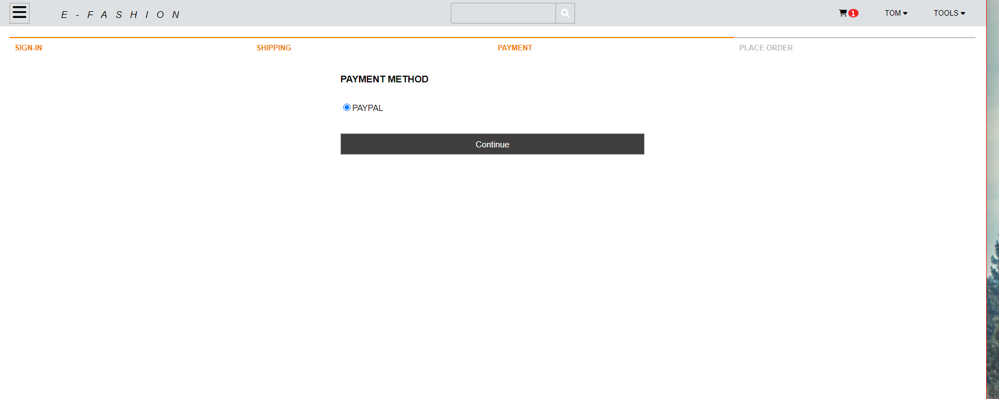
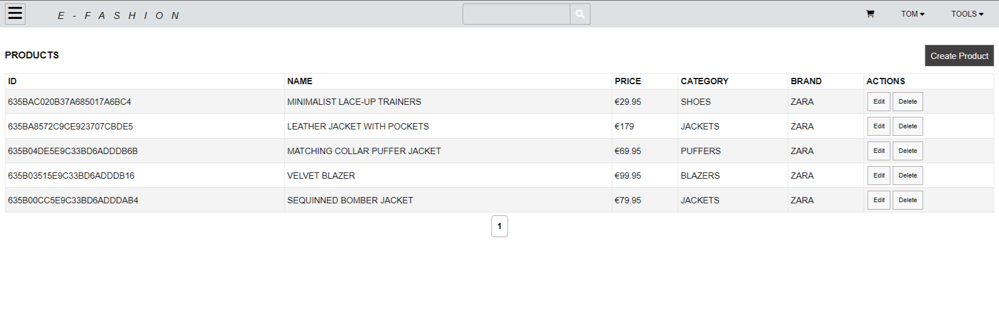

<!-- PROJECT LOGO -->
 

  

    'e-fashion' is a full stack app - this repository contains its backend source code.
     
        <a href="https://github.com/spatulatom/e-store-redux-mern#readme"><strong>View the frontend source code »</strong></a>
         
    <a href="https://e-fashion-dc7d0.web.app/"><strong>View the deployed app »</strong></a>
     
     
   
  

<!-- TABLE OF CONTENTS -->

  
Table of Contents

  <ol>
    <li><a href="#about-the-project">About The Project</a></li>
    <li><a href="#built-with">Built With</a></li>
    <li><a href="#acknowledgments">Acknowledgments</a></li>
  </ol>

<!-- ABOUT THE PROJECT -->
## About The Project

1. This app is a commerce online store, it provides:
* user authentication interface,
* many different filters for products search,
* pagination,
* search bar,  ratings and customers reviews,
* ratings and customers reviews,
* sandbox PayPal payment,
* tolls for managing cusomers accounts and customers orders,
* adding new products with ease,
* dasboard for checking the store general statistics.

2. Example of a single product's page:

3. Example of a filtering products. Filters used (chosen filters change font-color to red ): department - shoes, price- 10€-100€, rating - one star. The result is 2 products:

4. Purchase process:

* customer details

* chossing payment method

* Paypal sandbox payment - to test the payment log in to PayPal pop up window with these credentials:
email: sandbox.tom@example.com, password: sandbox1234

* verification of an complete payment

* verification of  a succesfull delivery

(<a href="#readme-top">back to top</a>)

5. Menu 'TOOLS' 

* DASBOARD

* PRODUCTS

* ORDERS

* USERS

(<a href="#readme-top">back to top</a>)

### Built With

* HTML, CSS,
* [![React][React.js]][React-url],
* Redux
* Node.js, Express.js, Mongoose, 
* MongoBD for a database,
* Firebase for deploying the frontend,
* Heroku for deploying the backend,
* Cloudinary API for storingg photos,
* Multer middleware library for uploading photos,
* bcrypt library for hashing passwords,
* jsonwebtoken for creating login token,
* Chrome Developer Tools for testing screen sizes and using Lighthouse,
* Chrome, Firefox, Brave Browser, Edge and Opera for browser testing the responsiveness,
* https://ui.dev/amiresponsive for testing and to make responsive image,
* https://favicon.io/favicon-generator/ to create a favicon,
* https://fontawesome.com/ for icons,
* https://tinypng.com/ to optimize images,
* https://www.remove.bg/ for removing images backgrounds,
* https://chrome.google.com/webstore/detail/pesticide-for-chrome-with/neonnmencpneifkhlmhmfhfiklgjmloi during development,
* https://wave.webaim.org/ to check web accessibility,
* https://balsamiq.com/ for wireframing.

(<a href="#readme-top">back to top</a>)

### Future development
* chat box for customers support with socket.io
* function of choosing the address on the map (insted of typing it) in the checkout process with the
usage of Google Maps Platform APIs

<!-- ACKNOWLEDGMENTS -->
## Acknowledgments

* all photos used in the app are free-to-use photos from www.pexels.com or photos from zara website https://www.zara.com

(<a href="#readme-top">back to top</a>)

<!-- MARKDOWN LINKS & IMAGES -->

[linkedin-shield]: https://img.shields.io/badge/-LinkedIn-black.svg?style=for-the-badge&logo=linkedin&colorB=555
[linkedin-url]: https://www.linkedin.com/in/tomasz-s-069249244/
[product-screenshot]: images/screenshot.png
[Next.js]: https://img.shields.io/badge/next.js-000000?style=for-the-badge&logo=nextdotjs&logoColor=white
[Next-url]: https://nextjs.org/
[React.js]: https://img.shields.io/badge/React-20232A?style=for-the-badge&logo=react&logoColor=61DAFB
[React-url]: https://reactjs.org/
[Vue.js]: https://img.shields.io/badge/Vue.js-35495E?style=for-the-badge&logo=vuedotjs&logoColor=4FC08D
[Vue-url]: https://vuejs.org/
[Angular.io]: https://img.shields.io/badge/Angular-DD0031?style=for-the-badge&logo=angular&logoColor=white
[Angular-url]: https://angular.io/
[Svelte.dev]: https://img.shields.io/badge/Svelte-4A4A55?style=for-the-badge&logo=svelte&logoColor=FF3E00
[Svelte-url]: https://svelte.dev/
[Laravel.com]: https://img.shields.io/badge/Laravel-FF2D20?style=for-the-badge&logo=laravel&logoColor=white
[Laravel-url]: https://laravel.com
[Bootstrap.com]: https://img.shields.io/badge/Bootstrap-563D7C?style=for-the-badge&logo=bootstrap&logoColor=white
[Bootstrap-url]: https://getbootstrap.com
[JQuery.com]: https://img.shields.io/badge/jQuery-0769AD?style=for-the-badge&logo=jquery&logoColor=white
[JQuery-url]: https://jquery.com 
